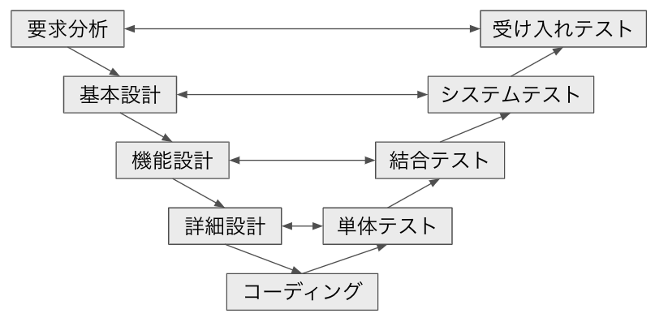

## 目次
1. [ソフトウェアテストの種類](#ソフトウェアテストの種類)
    1. [工程とは](#11-工程とは)
    2. [品質とは](#12-品質とは)
    3. [実行方法とは](#13-実行方法とは)
    4. [技法とは](#14-技法とは)

2. [V字モデル](#v字モデル)

3. [工程ごとのテストの種類](#工程ごとのテストの種類)
    1. [単体テストとは](#31-単体テストとは)
    2. [結合テストとは](#32-結合テストとは)
    3. [システムテストとは](#33-システムテストとは)
    4. [受け入れテストとは](#34-受け入れテストとは)

## 1. ソフトウェアテストの種類
ソフトウェアテストは、**工程**、**品質**、**実行方法**、**技法**という4つの方法で分類される

|項目|テスト|
|--:|:--|
|工程|単体テスト 結合テスト システムテスト 受け入れテスト|
|品質|機能テスト 性能テスト 負荷テスト ユーザビリティテスト セキュリティテスト|
|実行方法|動的テスト 静的テスト|
|技法|ブラックボックステスト ホワイトボックステスト|

### 1.1 工程とは
ソフトウェア開発の工程(要求分析→基本設計→機能設計→詳細設計→コーディング)に応じた各テストの分類方法。工程に合わせて段階的に実施する。

### 1.2 品質とは
機能をテストするのか。使いやすさをテストするのか、セキュリティをテストするのかといった、どのような品質をテストするかの観点で分類する方法。

### 1.3 実行方法とは
テストをどのように行うかによる分類方法。実際にプログラムを動かす**動的テスト**と、コードのレビュー等を行う**静的テスト**がある。

### 1.4 技法とは
テストケースを作る技法に関する分類方法。

## 2. V字モデル
V字モデルとは、ソフトウェアの開発工程とテスト工程の流れと、それぞれの対応関係をV字型の図で表したもの。

各工程が完璧に終了していることを前提として次の段階に進むため、後から前工程で問題が見つかると、その工程に戻って改めてやり直す必要が生じるので、より上位の工程で問題が見つかるほど負担が大きくなる。

## 3. 工程ごとのテストの種類
### 3.1 単体テストとは
個々のプログラム(コンポーネント、モジュール)が動作するかを単体でチェックするテストのこと。単体テストにおいては、プログラム、コンポーネント、モジュールの何がテスト対象になるかはプロジェクトによって異なる。

### 3.2 結合テストとは
単体テストでチェックしたプログラム(コンポーネント、モジュール)を組み合わせた時に、正常に動作するかを確かめるテストのこと。少数のプログラムの組み合わせから徐々に結合する範囲を広げていくことで、不具合が確認されたときにどのプログラムに原因があるか判断しやすい。

### 3.3 システムテストとは
プログラム全体をテストし、基本設計でまとめられた仕様通りにシステムが動作するかをチェックするテストのこと。できるだけ本番と同じ環境でテストすることが望ましい。

### 3.4 受け入れテストとは
要件定義にまとめられた要件を満たせているか確認するためのテストのこと。受け入れテストの目的は、不具合を見つけることではない。ユーザー自身で確認するユーザー受け入れテストや、実際のシステム運用に耐えられるかをシステム管理者が確認する運用受け入れテストなどがある。
